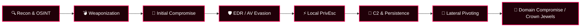

<div align="center">

  <!-- Header Animated Banner -->
  

  <!-- Animated Cyber Hacker Graphic -->
  <p align="center">
    
  </p>

  <!-- Dynamic Typing SVG Animation -->
  <a href="https://github.com/Not-Mostafa">
    
  </a>

  <br/>

  <!-- Status Badges -->
  <p align="center">
    
    
    
  </p>

  <!-- Social / Encryption Link Badges -->
  <p align="center">
    <a href="https://www.linkedin.com/in/mostafa-hossam-gbr" target="_blank">
      
    </a>
    <a href="mailto:mostafa2006391@gmail.com">
      
    </a>
    <a href="https://github.com/Not-Mostafa">
      
    </a>
    <a href="https://tryhackme.com/p/3mkMostafa" target="_blank">
      
    </a>
  </p>

</div>

---

### ⚡ C2 Shell Session Telemetry

```zsh
root@kali-c2:~# sliver-c2 --operator Mostafa
[*] Starting interactive C2 framework...
[+] Connected to Red Team Operations Server [10.10.13.37]
[*] Active Beacons: 6 | Sessions: 4 | Domain Admin: TRUE
[*] Target: CORP.LOCAL | Crown Jewels: COMPROMISED
root@kali-c2:~# cat << EOF
>> Mission: Advanced Threat Emulation, Low-Level Exploitation, Kernel & EDR Bypass.
>> Philosophy: "Offense informs Defense. Break it until you master it."
EOF
```

---

<div align="center">

## 🎯 Cyber Range & Battle Stations

<table>
  <tr>
    <td align="center" width="50%">
      <h3>🚩 TryHackMe Battle Station</h3>
      <a href="https://tryhackme.com/p/3mkMostafa" target="_blank">
        
      </a>
      <br/>
      
    </td>
    <td align="center" width="50%">
      <h3>⚔️ Hack The Box Battle Station</h3>
      <a href="https://app.hackthebox.com/profile/overview" target="_blank">
        
      </a>
      <p align="center">
        
        
      </p>
      <code>[+] Grinding Insane / Hard Boxes & Pro Labs</code>
    </td>
  </tr>
</table>

</div>

---

## 🧰 Offensive Security Weaponry & Tech Arsenal

<div align="center">

### 💥 Primary Exploit & Weaponization Languages
<p align="center">
  
</p>

### 🏴‍☠️ Offensive OS & Attacking Environments
<p align="center">
  
</p>

</div>

<br/>

| Offensive Domain | Weaponry & Specialized Tools | Tactical Focus |
| :--- | :--- | :--- |
| **Active Directory & Network Pwning** | `BloodHound`, `CrackMapExec / NetExec`, `Mimikatz`, `Impacket`, `Rubeus`, `Responder`, `Evil-WinRM` | Kerberoasting, AS-REP Roasting, Pass-the-Hash/Ticket, ACL Abuse, Golden/Silver Tickets |
| **C2 & Post-Exploitation** | `Cobalt Strike`, `Sliver C2`, `Mythic`, `Havoc`, `Empire`, `Chisel`, `Ligolo-ng` | Beaconing, Stealth Pivoting, Traffic Obfuscation, In-Memory Execution, Egress Traversal |
| **Binary Exploitation & Reversing** | `Ghidra`, `IDA Pro`, `Radare2 / Cutter`, `GDB / pwndbg`, `x64dbg`, `Frida`, `Ropper`, `pwntools` | Stack/Heap Exploitation, Buffer Overflows, ROP Chains, Shellcoding, Malware Analysis |
| **Web & API Penetration** | `Burp Suite Pro`, `OWASP ZAP`, `SQLmap`, `ffuf`, `Gobuster`, `Caido`, `Nuclei` | IDOR, SSRF, SSTI, Blind SQLi, GraphQL Injection, Race Conditions, Auth Bypass |
| **Payload Dev & EDR Evasion** | `C / C++`, `Rust`, `Win32 APIs`, `Direct Syscalls`, `Donut`, `Process Injection` | AMSI/ETW Patching, Unhooking, API Hashing, Shellcode Encryption, Process Hollowing |
| **Wireless, RFID & Hardware Ops** | `Aircrack-ng`, `Kismet`, `Flipper Zero`, `STM32`, `ESP8266 / ESP32`, `Proxmark3` | Wi-Fi Deauth/Handshake Capture, BadUSB/RubberDucky, Hardware Implants, UART Sniffing |

---

## 🩸 Adversary Emulation & Cyber Kill-Chain Matrix



---

<div align="center">

## 📊 Warfare Telemetry & GitHub Matrix

<!-- Animated Matrix / TokyoNight GitHub Stats -->
<p align="center">
  
  
</p>

<!-- Top Languages & Activity Visuals -->
<p align="center">
  
  
</p>

<!-- Animated Activity / Snake -->
<p align="center">
  
</p>

</div>

---

<div align="center">

<!-- Footer Capsule with Cyberpunk Glow -->


<p align="center">
  
</p>

<p align="center">
  <sub>⚠ DISCLAIMER: All offensive security tools, research, and adversary simulations are conducted strictly within authorized CTF ranges, lab environments, and legal red teaming engagements.</sub>
</p>

</div>
